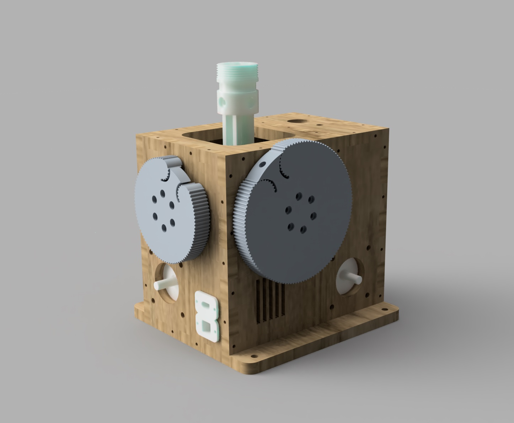

# VPForceKit-ffb-joystick-base plywood WIP
This project contains CAD files necessary for the mechanical assembly of a base of the VPForce kit (2x57BLF03 + USB kit).
This fork uses plywood available in the U.S. 1/4" or 1/2" rather than the 8mm from the original files. My laser cutter can only do 1/4" plywood reliably so I double stack each cut for a total of 1/2" thick walls. In some cases like the top, the bottom peice is different from the top peice in order to accomodate 2.5D features like switch cutouts. Making the walls thicker also required the bearing retainers be re-made so those have been updated as well.

Additionally this adds different gear profiles that allow for higher gear ratios and no need to buy exact belt sizes or worry about belt tension. It also includes a gimbal adapter allowing 2020 aluminum extrusion as an extension before the actual stick is installed. 

 

3d-print-parts - all elements which need to be printed  
DXF - drawings for case parts for laser cutting  
CAD - full STP assembly

## Bill of Materials

| VPForce Kit   | Quantity | Link |
|-------------- |:--------:|-----:|
|57BLF03 - 57x101mm - 1.6Nm peak - 1.24kg - NEMA23|1|[link](https://vpforcecontrols.com/) |

| Print Parts   | Quantity |
| ------------- |:--------:|
|bearing_retainer_half|4|
|bearing_retainer|4|
|customizable_fan_cover v3|1|
|GIMBAL_ARM_BEARING_PILLOW|4|
|GIMBAL_ARM_FRAME|2|
|GIMBAL_CORE_JOINT_6mm|1|
|GIMBAL_STICK_CONNECTOR TM|1|
|PULLEY_70T_Hollow|2|
|VPForce_Controller_Holder|1|

| LaserCut Parts Plywood 8mm| Quantity |
| -------------- |:--------:|
|Back-Panel|1|
|Buttom-Panel|1|
|Front-Panel|1|
|Left-Panel|1|
|Mid-Panel|1|
|Right-Panel|1|
|Top-Panel|1|

| Bearings                      | Quantity  | Link |
| ----------------------------- | --------- | ---- |
| 6802                          | 8  |[link](https://amzn.eu/d/eDOVoF4/) |
| 6808                          | 4  |[link](https://amzn.eu/d/eurbt7d/) |
| F625                          | 2  |[link](https://amzn.eu/d/9N6LxrD/) |

| Motor pulley                  | Quantity  | Link |
| ----------------------------- | --------- | ---- |
| HTD-5M-14T                    | 2  |[link](https://www.zahnriemen24.de/a/40140-zahnscheiben-5m?vorbohrungspannsatz=1&bohrung=1&quantity=1/) |

| Belts                  		| Quantity  | Link |
| ----------------------------- | --------- | ---- |
| HTD-420-5M/15                 | 1  |[link](https://www.zahnriemen24.de/a/40008-zahnriemen-5m/) |
| HTD-360-5M/15                 | 1  |[link](https://www.zahnriemen24.de/a/40008-zahnriemen-5m/) |
