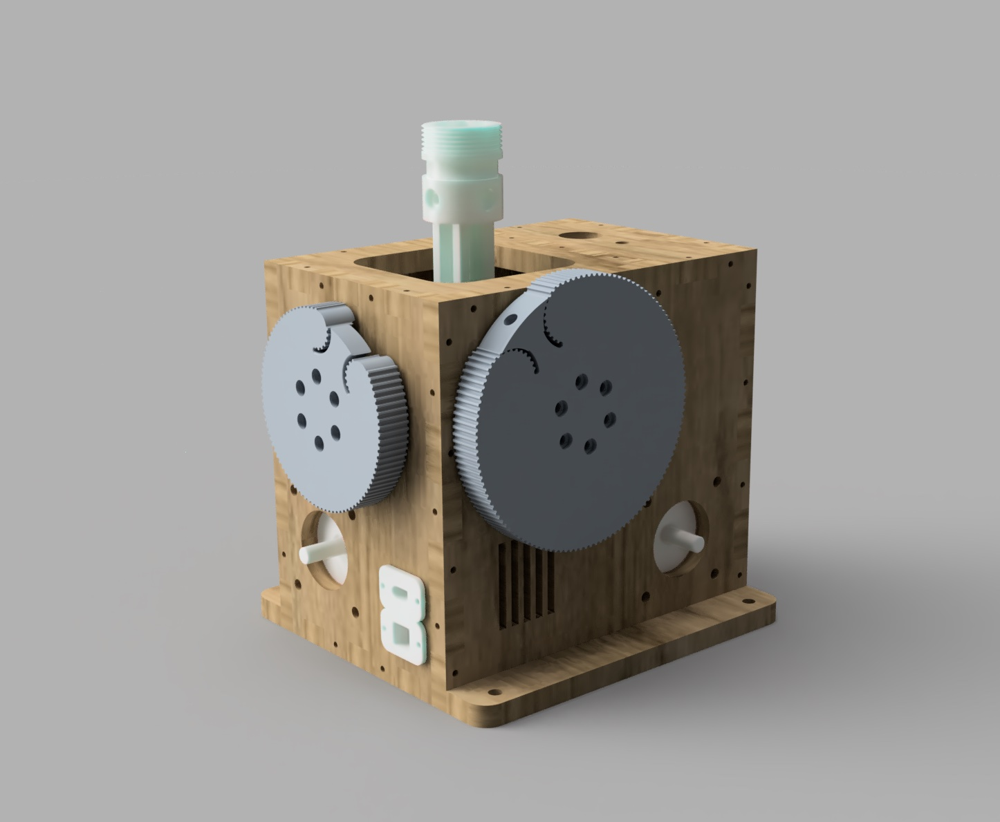

Work in Progress
This project contains CAD files necessary for the mechanical assembly of a base of the VPForce kit (2x57BLF03 + USB kit).
Why Fork from Mabo1972? Mabo's design is great, has a few small errors but generally "just works". If that design works for you I can do nothing but recommend it.
No files from Mabo1972's design are present here. Everything has been rebuilt from the ground up in CAD. Almost everything should be Mabo compatible such that if you decide something in that design is better, it should all work together (within reason, obviously all the laser cut walls need to work together, but the spacing of the motors / gears is compatible) . Most of my changes accomodate the tools I have or the materials I can get in the USA. I also plan to put together a kit of all of the below and offer it for sale.

One major change is that this design uses plywood available in the U.S. 1/4" rather than the 8mm from the original files. My laser cutter can only do 1/4" plywood reliably and with low Kerf so I double stack each cut for a total of 1/2" thick walls. In some cases like the top, the bottom peice is different from the top piece in order to accomodate 2.5D features like switchs, pots, and panel mount connectors.

An additional change is the power input of XT60. I like this connector for it's high reliability. You'll likely need to solder a connector on to whatever power supply you buy as it is rare to find power supplies with XT60 from the factory. 

Additionally this adds different gear profiles that allow an option for higher gear ratios and eliminates the need to buy exact belt sizes or worry about belt tensioning via motor slots or idlers. 
It also includes a gimbal adapter allowing 0.75" square aluminum tubing as an extension before the actual stick is installed using standard Thrustmaster / Virpil threads (M35x2). 

To that end, some amount of "handiness" is required for this kit. It is not for folks who do not enjoy DIY. There will be crimping, soldering, and troubleshooting required. If you do buy a kit realize that I'm not doing this for profit, I'm publishing this so that more people can get into force feedback because it is awesome and VPForce is fantastic. If the wait list was not as long as it is (as of July 2023) then I would not publish this. For the price of the "real" Rhino, it's very much worth it to just buy it from VPForce if you can handle the wait list.

 

3d-print-parts - all elements which need to be printed  
DXF - drawings for case parts for laser cutting  
CAD - F3D and STEP

Note that none of the below links are affiliate links. I make nothing from these links.

## Bill of Materials

| VPForce Kit   | Quantity | Link |
|-------------- |:--------:|-----:|
|57BLF03 - 57x101mm - 1.6Nm peak - 1.24kg - NEMA23|1|[VPForce Kit Order Sheet](http://order.vpforce.eu) |

| Print Parts   | Quantity |
| ------------- |:--------:|
|bearing_retainer_half|4|
|bearing_retainer|4|
|GIMBAL_ARM_BEARING_PILLOW|4|
|GIMBAL_ARM_FRAME|2|
|GIMBAL_CORE_JOINT_6mm|1|
|GIMBAL_STICK_CONNECTOR |1|
|Top_Adapter |1|
|PULLEY_96T|1|
|PULLEY_128T|1|
|VPForce_Controller_Holder|1|
|USB-B Panel Mount |1|

| LaserCut Parts Plywood 1/4"| Quantity |
| -------------- |:--------:|
|Rear|2|
|Bottom|2|
|Front Front|1|
|Front Rear| 1|
|Left Side|2|
|Mid Support|2|
|Right Side|2|
|Top Top |1|
|Top Bottom |1|

| Bearings                      | Quantity  | Link |
| ----------------------------- | --------- | ---- |
| 6802 (24x15x5mm)              | 8  | [JSB](https://jsbgreatbearings.com/68022rs-c-9_87/68022rs-premium-6802-2rs-seal-bearing-6802-ball-bearings-6802-rs-abec3-p-310.html)|
| 6808 (52x40x7mm)              | 4  | [JSB](https://jsbgreatbearings.com/68082rs-c-9_300/68082rs-two-side-rubber-seals-bearing-6808rs-ball-bearings-6808-rs-p-676.html)|
| F625 (16x5x5mm, 18x1mm flange)| 2  | [JSB](https://jsbgreatbearings.com/f625zz-c-3_505/flange-ball-bearing-f625zz-metal-shields-f625zz-high-quality-f625-zz-p-1022.html) |

Alternate source for bearings: [123bearings](https://123bearings.com)
Ebay is also a good source for these standard size bearings.

| Motor pulley                  | Quantity  | Link |
| ----------------------------- | --------- | ---- |
| 3GT -16Tooth-8mm Bore         | 2  |[ebay](https://www.ebay.com/itm/225592008473) |

| Belts                  		| Quantity  | Link |
| ----------------------------- | --------- | ---- |
| 3GT-3mm Open Loop Timing Belt | 1 meter|[ebay](https://www.ebay.com/itm/224467077690?var=523250397611) |

|Electronics                |Quantity | Link|
|---------------------------| -------- | ---- |
|DIN5 Female Connector      | 1  |[Digikey](https://www.digikey.com/en/products/detail/cui-devices/MD-50PL100/500828)|
|XT 60 Panel Mount Male & Female  | 2 (1ea)  |[Amazon](https://a.co/d/0gA4TEY) |
|19V 180W+ DC Power Supply | 1  | [Amazon](https://a.co/d/iy1mMZF)|
|Emergency Cutoff Switch 10A| 1  |[Amazon](https://a.co/d/2vKUG6i) |
|10k Potentiometer          | 2  |[Amazon](https://a.co/d/dEJRBl2) |
|10 Conductor Wire (1ft req) | 1 |[Amazon](https://a.co/d/eSipjIW) |
|80mm 24V fan | 1| [Amazon](https://a.co/d/5TQbYCp)|
|USB-B Panel Mount | 1| [Amazon](https://a.co/d/8rjkGPT)|
|Alternate USB-C Panel Mount with adapter| 1 ea| [USB-C Panel Mount](https://a.co/d/2RB9gru) [USB-C wire plug](https://a.co/d/2es5Zsm)|
|DIN5 Male if you want to make an extension |1| [Digikey](https://www.digikey.com/en/products/detail/cui-devices/MD-50/96914)|

|Hardware                |Quantity | Link|
|---------------------------| -------- | ---- |
|M4x12mm Bolts for Bearing Pillows  |  8  | [Bolt Depot](https://www.boltdepot.com/Product-Details.aspx?product=13341) |
|M6x20mm Motor Mount Bolts          |  8  | [Bolt Depot](https://www.boltdepot.com/Product-Details.aspx?product=13352) |
|M6 Motor Mount Lock Washers        |  8  | [Bolt Depot](https://www.boltdepot.com/Product-Details.aspx?product=4813) |
|M6 Motor Mount Washers        |  8  | [Bolt Depot](https://www.boltdepot.com/Product-Details.aspx?product=4516) | 
|M5x12mm Aluminum Square Tube to gimbal  | 8 | [Bolt Depot](https://www.boltdepot.com/Product-Details.aspx?product=13344) |
|M5x50mm Bolt through center gimbal connector | 1| [Bolt Depot](https://www.boltdepot.com/Product-Details.aspx?product=13344) |
|M5 Washer |  2 | [Bolt Depot](https://www.boltdepot.com/Product-Details.aspx?product=4515)|
|M5 Lock Nut | 1 | [Bolt Depot](https://www.boltdepot.com/Product-Details.aspx?product=4794)|
|M4 Locking Hex Nuts for Gimbal Arms | 12| [Bolt Depot](https://www.boltdepot.com/Product-Details.aspx?product=4793)|
|M4x35mm Cap Bolts to connect gears to Gimbal Arms | 12 | [Bolt Depot](https://www.boltdepot.com/Product-Details.aspx?product=18949)|
|M2.5 screws to hold VPForce board to standoffs |4|[Bolt Depot](https://www.boltdepot.com/Product-Details.aspx?product=24854) |
|M3x25 bolts to hold bearing holders in place | 16|[Bolt Depot](https://www.boltdepot.com/Product-Details.aspx?product=18942) |
|M3 lock nuts | 16|[Bolt Depot](https://www.boltdepot.com/Product-Details.aspx?product=4792)|
|M3 lock washers | 16 | [Bolt Depot](https://www.boltdepot.com/Product-Details.aspx?product=4810)|
|M3 washers |32 |[Bolt Depot](https://www.boltdepot.com/Product-Details.aspx?product=4513)|
|Bolt Depot cart with all above hardware| | [Bolt Depot](https://www.boltdepot.com/cart/215477)|
|M3 screws to install VPForce board into chassis |2| Find in parts bin |
|#8-1" Self Drilling Wood Screws |  1pkg | [Amazon](https://a.co/d/aeVexTG)|
|Hardware to mount to your SIM PIT | 4 | 5mm mounting holes|
|M4 Inserts High Quality | 8| [Amazon](https://a.co/d/0r7RgK8)|

